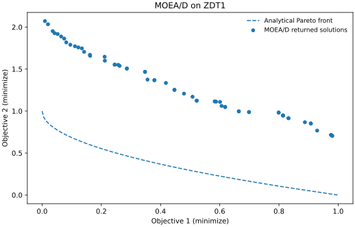

# MOEA/D

**Multiobjective Evolutionary Algorithm based on Decomposition** assigns a scalar subproblem to each weight vector and shares solutions between neighbouring subproblems [1]. This tutorial runs an unconstrained, real-coded example using the stable public API in **VAMOS 1.0.0**.

[All algorithms](../reference/algorithms.md) · [Configuration reference](../reference/api/algorithms/moead.md) · [Installation](../guide/installation.md)

## Run an example

Use **ZDT1 with 30 variables**, **100 subproblems**, **10,000 evaluations**, **NumPy**, and **seed 42**. The initial population counts towards the budget. These settings illustrate the workflow; they are not tuned or evidence of comparative performance.

```python
from vamos import optimize
from vamos.algorithms import MOEADConfig
from vamos.problems import ZDT1

problem = ZDT1(n_var=30)
config = MOEADConfig.default(
    pop_size=100, n_var=problem.n_var, n_obj=problem.n_obj
)
result = optimize(
    problem,
    algorithm="moead",
    algorithm_config=config,
    max_evaluations=10_000,
    engine="numpy",
    seed=42,
)
print(result.X.shape)  # (number of returned solutions, 30)
print(result.F.shape)  # (number of returned solutions, 2)
print(result.data["evaluations"])  # 10000
```

The [executable example](https://github.com/vamos-optimization/VAMOS/blob/main/examples/journeys/moead_zdt1.py) uses precisely these settings. From a checkout with VAMOS installed:

```bash
python examples/journeys/moead_zdt1.py
```

## Understand the result



*Actual run: VAMOS 1.0.0, NumPy, seed 42, 100 subproblems, 10,000 evaluations. The dashed curve is analytical, not another run.*

Each row of `X` is a decision vector and the corresponding row of `F` gives its objectives. The default result mode selects non-dominated solutions from the final population, so the number returned need not equal 100. Inspect `result.data["population"]` for the whole final population. The visible gap to the dashed curve shows that this default configuration has not converged at the chosen budget: a non-dominated result can still be far from the true front. The figure intentionally shows that residual error instead of treating budget completion as a quality guarantee.

For ZDT1 the analytical front is `f2 = 1 - sqrt(f1)`, with `0 <= f1 <= 1`. It is shown to help assess the result; it is not supplied to the optimizer. The weights used by MOEA/D are directions in objective space, **not points on that front**, and are not preferred solutions specified by a user.

To regenerate the illustration at a new path:

```bash
python -m pip install matplotlib
python examples/journeys/moead_zdt1.py --output moead-zdt1.svg
```

Existing files are refused. For a fast execution check, use `--pop-size 20 --max-evaluations 203`; this deliberately short run does not reproduce the illustration's approximation quality.

## What the configuration means

The default real-coded configuration uses differential evolution (`cr=1.0`, `f=0.5`), polynomial mutation (`eta=20`, probability `1/n_var`), PBI aggregation (`theta=5`), neighbour size 20, neighbourhood selection probability 0.9 and replacement limit 2. These are VAMOS configuration choices, not a claim that every MOEA/D variant uses them.

| Decision | Consequence |
| --- | --- |
| Population and weights | One incumbent is associated with each weight vector; use matching cardinalities. |
| Neighbour size | Controls how many nearby weight vectors participate in local cooperation. |
| `delta` | Controls how often mating draws from the neighbourhood rather than the whole population. |
| Aggregation | PBI, Tchebycheff and weighted sum define different scalar subproblems; objective scales and front geometry affect the choice. |
| Replacement limit | Bounds how many incumbents one new solution can replace. |
| `batch_size` | The tutorial uses one generated candidate per step; changing batching changes search dynamics. |

For two objectives, `MOEADConfig.default(pop_size=100, n_obj=2, ...)` requests 99 divisions and therefore 100 uniformly spaced weights. For `m` objectives and a simplex lattice with `p` divisions, the count is `comb(p + m - 1, m - 1)`. For example, three objectives and 12 divisions give **91**, not 100. Explicit files must also contain exactly one vector per population member. Incompatible cardinalities raise an error; budget reduction is not a way to repair a mismatched configuration.

The `n_obj` argument matters: the default factory otherwise assumes three objectives. Supply the real problem dimension and objective count as above. Its default operators are real-coded; for discrete problems, choose compatible operators through the builder or the encoding-aware optimization setup. See the [capability matrix](../reference/algorithms.md#capability-matrix).

## Constraints, archives and reproducibility

This example is unconstrained. MOEA/D supports feasibility-based comparison with the `G <= 0` convention; the [constraint reference](../reference/constraints.md) explains how to supply residuals. A scatter plot of objectives alone does not establish feasibility.

An optional external archive stores non-dominated results separately from the working population. Choose `result_mode="population"` explicitly when the final population is the required output; otherwise an enabled external archive becomes the result source. The [MOEADConfig reference](../reference/api/algorithms/moead.md) documents result-archive configuration. The [stopping and archive hooks](../experiment/stopping_and_archive.md) maintain a separate objective-space observation archive. Preserve the resolved configuration, effective backend and seed with the [run lifecycle](../guide/run-artifacts.md).

## References

[1] Zhang, Q., and Li, H. (2007). [MOEA/D: A Multiobjective Evolutionary Algorithm Based on Decomposition](https://doi.org/10.1109/TEVC.2007.892759). *IEEE Transactions on Evolutionary Computation*, 11(6), 712–731.
