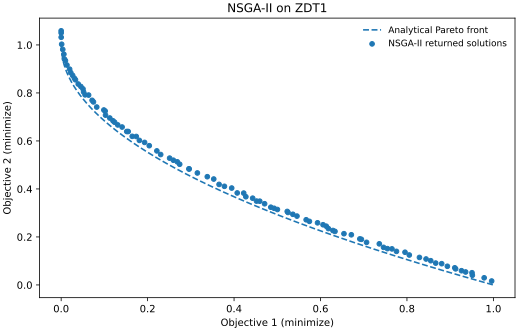

# NSGA-II

**Non-dominated Sorting Genetic Algorithm II** combines Pareto ranking with crowding distance to select a diverse population. Use this page to run and understand a two-objective example. For exact signatures and builder methods, use the separate [NSGA-II configuration reference](../reference/api/algorithms/nsgaii.md).

[All algorithms](../reference/algorithms.md) · [Define your own problem](../guide/custom-problem.md) · [Result API](../reference/api/results.md)

## Run an example

This example uses **ZDT1 with 30 real variables**, a population of **100**, a budget of **10,000 evaluations**, the **NumPy backend**, and **seed 42**. These are the settings of this tutorial, not a tuned configuration or a claim of superiority over other algorithms. Follow the [installation guide](../guide/installation.md) first; optimization itself does not require plotting dependencies.

```python
from vamos import optimize
from vamos.algorithms import NSGAIIConfig
from vamos.problems import ZDT1

problem = ZDT1(n_var=30)
config = NSGAIIConfig.default(pop_size=100, n_var=problem.n_var)
result = optimize(
    problem,
    algorithm="nsgaii",
    algorithm_config=config,
    max_evaluations=10_000,
    engine="numpy",
    seed=42,
)

print(result.X.shape)  # (number of returned solutions, 30)
print(result.F.shape)  # (number of returned solutions, 2)
print(result.data["evaluations"])  # 10000 for this uninterrupted run
```

The complete [executable example](https://github.com/vamos-optimization/VAMOS/blob/main/examples/journeys/nsgaii_zdt1.py) runs the same configuration and can also generate the illustration. From a checkout with VAMOS installed:

```bash
python examples/journeys/nsgaii_zdt1.py
```

## Understand the result



*Illustrative run: NumPy, seed 42, population 100, 10,000 evaluations. The points are computed by the linked script, not drawn by hand. The dashed curve is an analytical reference, not another optimization run.*

Each row `result.X[i]` is a decision vector; `result.F[i]` contains its two objective values. Moving towards the lower-left improves both objectives, but along the trade-off curve an improvement in one objective costs performance in the other. There is no single preferred solution without an additional decision criterion.

For this unconstrained example, `result.F` contains the non-dominated solutions selected from the final population. Its row count is **not guaranteed to equal the population size**. The complete final population is available through `result.data["population"]`. The [result API](../reference/api/results.md) describes the container and its selection helpers.

For ZDT1, the reference curve is `f2 = 1 - sqrt(f1)` for `0 <= f1 <= 1`. The reference does **not** guide this NSGA-II run. The visible distance to it is residual approximation error: a completed budget does not guarantee convergence. A single seed and one problem do not establish comparative performance.

To generate your own SVG, install the plotting dependency and choose a **new** output filename:

```bash
python -m pip install matplotlib
python examples/journeys/nsgaii_zdt1.py --output nsgaii-zdt1.svg
```

The script refuses to overwrite an existing file. A short smoke run uses `--pop-size 20 --max-evaluations 200`; it tests execution, not convergence, and will not reproduce the illustration above.

## How selection works

For the generational configuration used here, the algorithm repeatedly performs the following cycle [1]:

1. Select parents, then apply crossover and mutation to create offspring.
2. Evaluate offspring and combine them with the current population.
3. Sort the combined solutions into non-dominated fronts. Prefer lower-rank fronts.
4. Fill the next population with complete fronts; when the final accepted front does not fit, prefer larger crowding distances within that front.

Crowding distance estimates local spacing in objective space using normalized neighbouring objective differences. Boundary solutions receive special treatment to preserve extremes. It is a diversity criterion, **not** a distance to the true Pareto front. In the tutorial configuration, tournament selection also uses rank and crowding.

This is the algorithmic idea. The encoding, variation operators, constraint handling, result selection and optional archives below are implementation/configuration choices that must be reported separately when comparing runs.

## Configure the run

`NSGAIIConfig.default(...)` is a convenient starting point. Supplying `n_var` makes its mutation probability depend on the actual problem dimension. To make the tutorial's real-coded variation explicit, use the builder:

```python
from vamos.algorithms import NSGAIIConfig

config = (
    NSGAIIConfig.builder()
    .pop_size(100)
    .crossover("sbx", prob=1.0, eta=20.0)
    .mutation("pm", prob="1/n", eta=20.0)
    .selection("tournament", size=2)
    .build()
)
```

Pass that `config` as `algorithm_config` to `optimize()` as above. The string `"1/n"` resolves using the problem's number of variables; for the 30-variable example it is `1/30`.

| Choice | What to consider |
| --- | --- |
| `pop_size` | Changes population cardinality and the allocation of a fixed evaluation budget. A larger value is not automatically better. |
| `offspring_size` | When omitted, resolves to population size. Smaller batches change the replacement regime; do not treat them as merely a speed switch. |
| Crossover and mutation | Choose operators compatible with the problem encoding. The SBX/polynomial-mutation example above is real-coded. |
| `max_evaluations` | Includes evaluation of the initial population. The budget must be large enough to initialize it. |
| `seed` and `engine` | Record both, together with the environment and resolved configuration. |

This table explains decisions rather than duplicating every signature and default. The [configuration reference](../reference/api/algorithms/nsgaii.md) is generated directly from the implementation.

## VAMOS capabilities and limits

The default factory has branches for real, binary, integer, permutation and mixed encodings. For a non-real problem, provide its actual `encoding` to `NSGAIIConfig.default(...)`; using a real-coded configuration is not an encoding conversion. Consult the [problem contracts](../reference/problems.md) and [custom-problem guide](../guide/custom-problem.md), particularly for mixed-variable specifications. This tutorial validates the real-coded ZDT1 path, not every possible operator/problem combination.

With the default feasibility constraint mode, feasible candidates are favoured over infeasible ones; selection then uses objective space among feasible candidates and total violation among infeasible candidates. Constraints use the `G <= 0` convention. The present ZDT1 example has no constraints; follow the [custom-problem guide](../guide/custom-problem.md) for a constrained problem rather than inferring feasibility from an objective scatter plot.

Without an external archive, the default result mode is `non_dominated`; `population` returns the final population. Enabling an external archive changes the default source of returned solutions unless population mode is requested explicitly. The archive is not the population: inspect `result.data["archive"]` and `result.data["population"]` separately. See [stopping and archives](../experiment/stopping_and_archive.md) before changing either policy.

The [1.x stability policy](../project/stability-and-versioning.md) defines the supported public surface. Reusing a seed is not a promise of bitwise identity across backends or environments. Use [saved runs, verification and replay](../guide/run-artifacts.md) to retain the resolved configuration and environment for a reproducible workflow.

## Continue

Replace ZDT1 using [your own objective function](../guide/custom-problem.md), or organize multiple algorithms, problems and seeds as a [durable study](../guide/studies.md). The [algorithm index](../reference/algorithms.md) links to the other built-in configurations without making an unsupported performance ranking.

## References

[1] Deb, K., Pratap, A., Agarwal, S., and Meyarivan, T. (2002). [A fast and elitist multiobjective genetic algorithm: NSGA-II](https://doi.org/10.1109/4235.996017). *IEEE Transactions on Evolutionary Computation*, 6(2), 182–197.

For example/figure provenance and maintenance, see [algorithm documentation](../dev/algorithm-documentation.md).
