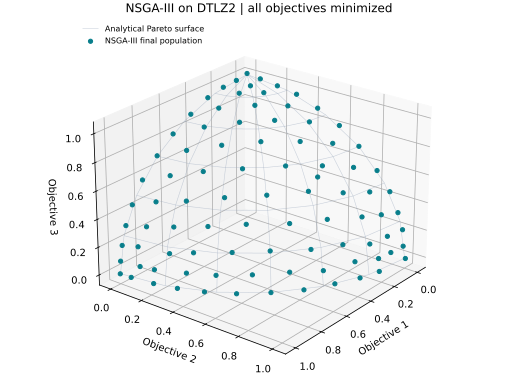

# NSGA-III

**Non-dominated Sorting Genetic Algorithm III** combines Pareto ranking with reference-direction niching to distribute a population in objective space [1]. This tutorial uses the stable public API in **VAMOS 1.0.0** on an unconstrained three-objective problem.

[All algorithms](../reference/algorithms.md) · [Configuration reference](../reference/api/algorithms/nsgaiii.md) · [Installation](../guide/installation.md)

## Match population and reference directions

A simplex lattice with `p` divisions and `m` objectives has `comb(p + m - 1, m - 1)` directions. Here, **three objectives** and **12 divisions** give `comb(14, 2) = 91`. The population must also contain **91** solutions. A mismatched explicit lattice raises `ValueError` in VAMOS 1.0.0; do not rely on automatic resizing or a warning.

The directions promote coverage during survival selection. They are not a supplied Pareto front and do not guarantee one final solution in each niche.

## Run an example

Use **DTLZ2 with 12 real variables and three objectives**, **91 solutions**, **10,000 evaluations**, **NumPy**, and **seed 42**. The explicit `population` result mode makes the returned arrays easy to interpret.

```python
from math import comb

from vamos import optimize
from vamos.algorithms import NSGAIIIConfig
from vamos.problems import DTLZ2

problem = DTLZ2(n_var=12, n_obj=3)
divisions = 12
pop_size = comb(divisions + problem.n_obj - 1, problem.n_obj - 1)
config = (
    NSGAIIIConfig.builder()
    .pop_size(pop_size)
    .crossover("sbx", prob=1.0, eta=30.0)
    .mutation("pm", prob="1/n", eta=20.0)
    .selection("tournament")
    .reference_directions(divisions=divisions)
    .result_mode("population")
    .build()
)
result = optimize(
    problem,
    algorithm="nsgaiii",
    algorithm_config=config,
    max_evaluations=10_000,
    engine="numpy",
    seed=42,
)
print(result.X.shape)  # (91, 12)
print(result.F.shape)  # (91, 3)
print(result.data["evaluations"])  # 10000
```

The [executable example](https://github.com/vamos-optimization/VAMOS/blob/main/examples/journeys/nsgaiii_dtlz2.py) runs the same configuration. From a checkout with VAMOS installed:

```bash
python examples/journeys/nsgaiii_dtlz2.py
```

## Understand the result



*Actual run: VAMOS 1.0.0, NumPy, seed 42, 91 directions and solutions, 10,000 evaluations. The grey wireframe is analytical, not another optimization run.*

All three objectives are minimized. DTLZ2's analytical Pareto surface satisfies `f1² + f2² + f3² = 1` in the positive octant. The returned vectors approach this trade-off surface; a completed budget does not prove convergence or uniform coverage. The analytical wireframe is used only for interpretation.

`result.F` is the **final population**, because the example requests it explicitly. Some rows can be dominated. Use `result.front()` to extract its non-dominated objective rows. The initial 91 evaluations count towards the total; the final offspring batch is bounded so this uninterrupted run performs exactly 10,000 evaluations.

To regenerate the illustration at a new filename:

```bash
python -m pip install matplotlib
python examples/journeys/nsgaiii_dtlz2.py --output nsgaiii-dtlz2.svg
```

Existing files are refused. A fast execution check uses `--divisions 3 --max-evaluations 203` (10 directions and solutions). It checks the workflow rather than reproducing the full illustration's quality.

## How survival works

For each generation, NSGA-III combines parents and offspring, sorts candidates into non-dominated fronts and fills the next population with complete fronts. If the next front does not fit, it normalizes objectives, associates candidates with reference directions and fills the remaining slots using niche occupancy and distance to the directions [1].

| Decision | What to check |
| --- | --- |
| Objective count and divisions | Recompute population cardinality whenever either changes. The number of directions grows combinatorially. |
| Variation | The SBX/polynomial-mutation combination above is real-coded. Discrete encodings require compatible operators. |
| Objective scaling | Niching uses normalized objectives; difficult geometry and degeneracy still affect coverage. |
| Result mode | `population` returns all survivors; `non_dominated` filters the selected result source. |
| Budget | Cover initialization and report the exact number of evaluations, rather than assuming a whole number of generations. |

For explicit reference-direction files, each row must be non-negative, sum to one, have one column per objective and match the configured population count. Consult the [configuration reference](../reference/api/algorithms/nsgaiii.md) for the file option.

## Scope and limitations

**Use this tutorial for unconstrained problems.** The VAMOS 1.0.0 implementation can evaluate and retain `G`, but its environmental selection ranks objective values without constraint-aware survival. Setting `constraint_mode="feasibility"` does not establish full constrained NSGA-III support. The same limitation exists in the current source inspected for this page. Choose a constraint-aware implementation in the [capability matrix](../reference/algorithms.md#capability-matrix) when feasibility must affect survival.

An optional external archive is distinct from the population and from the reference directions; the directions are never a solution archive. Set result mode explicitly when combining archive and population requirements. See [archives](../experiment/stopping_and_archive.md) and [saved runs](../guide/run-artifacts.md).

The example demonstrates execution and output interpretation. It does not establish superiority over NSGA-II, MOEA/D or any other algorithm; compare multiple seeds and problem instances under a documented study protocol.

## References

[1] Deb, K., and Jain, H. (2014). [An Evolutionary Many-Objective Optimization Algorithm Using Reference-Point-Based Nondominated Sorting Approach, Part I: Solving Problems With Box Constraints](https://doi.org/10.1109/TEVC.2013.2281535). *IEEE Transactions on Evolutionary Computation*, 18(4), 577–601.
