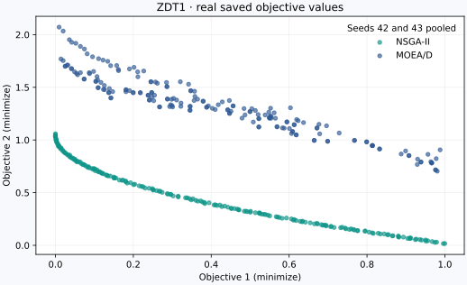

# VAMOS Studio

**Status: Experimental.** Studio is a local Panel application for exploring
saved studies, viewing objective values, and inspecting candidate solutions.
Its interface and ranking helpers are outside the stable VAMOS 1.x contract;
see [Stability and versioning](../project/stability-and-versioning.md).

## See a real study



*Real optimization output generated with VAMOS 1.0.0, not a Studio screenshot:
ZDT1, NSGA-II and MOEA/D, seeds 42 and 43, population 100, NumPy backend,
10,000 evaluations per run. The two seeds are pooled for each algorithm.
This is a walkthrough dataset, not evidence that one algorithm is better.*

!!! note "Launcher status — VAMOS 1.0.1"
    The published `vamos studio` launcher currently serves a module that does
    not register its Panel template, which can produce a blank page. Its
    study-path argument is also not passed into the application state.
    Until the launcher is corrected, use the stable inspection commands
    below or the [Python results workflow](understanding-results.md).

### Prepare the same data

Install the [published package](installation.md), then download
[`prepare_studio_demo.py`](https://github.com/vamos-optimization/VAMOS/blob/main/examples/journeys/prepare_studio_demo.py)
using GitHub's **Download raw file** action. Run it from the folder containing
the downloaded script:

```bash
python prepare_studio_demo.py --output results/studio-demo
vamos study inspect results/studio-demo
vamos study summarize results/studio-demo
```

The script uses only the stable public API. It plans and executes **4 runs with
a total budget of 40,000 evaluations**, then verifies that all four completed.
Choose a new output directory if that path already exists. In a repository
checkout, the script is at `examples/journeys/prepare_studio_demo.py`.

The two `vamos study` commands work independently of Studio. They inspect
persisted data without running the optimizers again. For a broader experiment,
follow the [reproducible study guide](studies.md).

To regenerate the figure above, install the `analysis` extra and add
`--plot studio-study.svg` to the script command, again choosing a fresh study
output directory. The figure plots the saved objective values without modifying
or filtering them.

### Read the Results Explorer

When the Studio interface is available:

1. Open **Explore Results** in the sidebar.
2. Set **Study directory** to the exact study root, such as
   `results/studio-demo`, and click **Load Study**. It must contain
   `study-manifest.json`; the parent `results/` folder is not a study.
3. Check the status: this example should say **Loaded 4 runs, 2 fronts**.
   A message about *demo data* or a loading error means your study was not
   loaded. The built-in fallback is synthetic and must not be interpreted as
   your results.
4. Inspect **Pareto Front Overlay**. Hover over points to read `f1` and `f2`;
   click a legend entry to hide or show an algorithm. Both ZDT1 objectives are
   minimized, so improvements move toward the lower left.
5. Change **MCDM method** or **Top K solutions** to explore **Solution Rankings**.
   Ranks are calculated separately for each algorithm's pooled solutions;
   they are not ranks of algorithms or a statistical comparison.

Studio displays the saved objective vectors. A returned population can contain
dominated points, and the plot title does not certify that every point is
non-dominated or lies on the true Pareto front. See
[Understanding results](understanding-results.md) for those distinctions.

For this release, load a **single-problem study** when comparing traces: the
overlay uses the first two objectives and does not separate different problems.
For more than two objectives, it is only a two-dimensional projection.
The **Export CSV** action currently exports up to Top K rows from the first
loaded front in stored order; it does not export the combined ranking table.
Use the [analysis workflow](../topics/analysis.md) for controlled plots and
exports.

## Installation and launch options

Studio's optional dependencies are installed from PyPI:

```bash
python -m pip install "vamos-optimization[studio]==1.0.1"
```

The packaged command and its intended study-root argument are:

```bash
vamos studio --study-dir results/studio-demo
```

**The 1.0.1 launcher limitation described above applies to this command.**
Reinstalling optional dependencies does not fix the missing template
registration. The flags below describe the launcher's binding behavior, not
a workaround for that issue.

The server binds to `127.0.0.1:5006` by default. To choose another loopback
address or port:

```bash
vamos studio --address ::1 --port 5010 --study-dir results/studio-demo
```

A non-loopback address is rejected unless you separately acknowledge the
network exposure:

```bash
vamos studio --address 0.0.0.0 --allow-remote-binding --no-browser
```

Remote binding exposes an experimental local application to other network
users. Apply operating-system firewall and access controls appropriate to the
environment; Studio does not provide an authentication boundary.

## Data-only exploration

The Results Explorer reads canonical run and study artifacts through
`load_run`, `load_result`, and `load_study`. It does not resolve plugins,
reconstruct components, or invoke replay. Use the explicit stable
`vamos reproduce` command when execution is intended.

## Trusted local Python

The **Problem Builder** can compile and execute Python entered by the user or
generated by an LLM. This is disabled by default. Before a preview can run,
Studio displays the complete objective and constraint code and requires the
user to select an explicit acknowledgement for the current code. Editing or
regenerating that code clears the acknowledgement.

> Trusted local Python code executes with the permissions of your current
> operating-system user. Review the complete code before opting in.

Generated code is never executed automatically. Syntax-tree validation,
restricted built-ins, a child process, timeouts, and best-effort resource
limits reject some unsupported inputs and reduce accidental damage; they do
not isolate untrusted Python and are not a security boundary. Do not opt in for
code from an untrusted source. Studio does not log generated code or API-key
values.

Generating a standalone script only displays text; running that exported
script remains a separate user action outside Studio.

## Optional dependencies

Interactive plots and tables use Panel, Plotly, and pandas from the `studio`
extra. Provider-backed code generation may require a provider-specific API key.
Prefer environment-based credentials; values entered in the password field are
held only in the running process and are not included in Studio status output.
