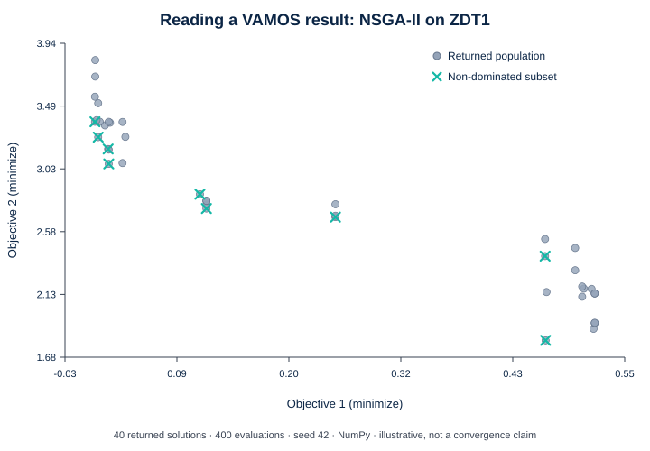

# Quickstart: run, read, then preserve a result

This guide uses only the stable VAMOS 1.0.0 facades. Install the core package as described in the [installation guide](installation.md).

For a repository-checkout version that you can run unchanged, use the [Try VAMOS executable journey](../examples.md#try-vamos).

## 1. Run one optimization

```python
from vamos import optimize

result = optimize(
    "zdt1",
    algorithm="nsgaii",
    max_evaluations=400,
    pop_size=40,
    engine="numpy",
    seed=42,
)

print(result.F.shape)
print(result.X.shape)
print(result.data["evaluations"])
```

`F` contains objective values and `X` contains the corresponding decision variables. Row `i` in `X` belongs to row `i` in `F`. `max_evaluations` is a hard budget; it is not the number of rows returned.

NumPy is the deterministic reference backend. Reproducibility is a same-environment promise, not a cross-platform or cross-backend bitwise promise.

## 2. Read the result before doing anything else

The simple call above returns the final 40-member NSGA-II population. Extract its non-dominated subset with the result object itself:

```python
front_F, front_indices = result.front(return_indices=True)
front_X = result.X[front_indices]

print(front_F.shape)
print(front_X.shape)
```



*NumPy, seed 42, population 40, 400 evaluations. This short run illustrates the structure of an `OptimizationResult`; it is not a convergence or performance claim.*

The crosses are non-dominated **within the returned population**. They are not automatically the mathematical Pareto front. The dedicated [Understanding optimization results](understanding-results.md) guide explains `X`, `F`, `front()`, result modes, population/archive data, and why selecting one preferred point requires an additional decision rule.

!!! tip "A useful stopping point for a first session"
    If this is your first VAMOS run, you now have the complete minimal loop: execute a bounded optimization and understand what its arrays represent. The remaining sections extend that loop to custom problems, explicit configuration and reproducible evidence.

## 3. Replace the benchmark with your model

A custom problem is the same optimization loop with your domain model behind `make_problem(...)`. Start by naming the decisions and outputs rather than by copying a benchmark formula.

This small teaching surrogate uses temperature and residence time as decisions, minimizes an energy score and a conversion-shortfall score, and requires `temperature * residence_time >= 450`.

```python
from vamos import make_problem, optimize


def objectives(x):
    temperature, residence_time = x
    energy_score = ((temperature - 60.0) / 40.0) ** 2 + 0.25 * (residence_time / 10.0)
    conversion_shortfall = (100.0 - temperature) / 40.0 + 2.0 / residence_time
    return [energy_score, conversion_shortfall]


def constraints(x):
    # temperature * residence_time >= 450
    # becomes 450 - temperature * residence_time <= 0
    temperature, residence_time = x
    return [450.0 - temperature * residence_time]


problem = make_problem(
    objectives,
    n_var=2,
    n_obj=2,
    bounds=[(60.0, 100.0), (2.0, 10.0)],
    encoding="real",
    constraints=constraints,
    n_constraints=1,
)

result = optimize(
    problem,
    algorithm="nsgaii",
    max_evaluations=400,
    pop_size=40,
    engine="numpy",
    seed=42,
)
```

The equations above are illustrative, not a validated physical process model. The [Solve your own problem](custom-problem.md) guide shows how to map real variables, bounds, objectives and constraints into this interface, validate the evaluator before optimization, vectorize an existing batch model, and translate the returned rows back into domain quantities.

## 4. Use an explicit algorithm configuration

```python
from vamos import optimize
from vamos.algorithms import NSGAIIConfig
from vamos.problems import ZDT1

problem = ZDT1(n_var=30)
configuration = NSGAIIConfig.default(pop_size=40, n_var=problem.n_var)

result = optimize(
    problem,
    algorithm="nsgaii",
    algorithm_config=configuration,
    max_evaluations=400,
    seed=42,
)
```

Use a public configuration object when the exact operators and their settings need to be preserved. VAMOS rejects a configuration that does not match the selected algorithm.

Result selection also belongs to the algorithm configuration. In particular, the explicit NSGA-II configuration above uses its configuration-level `non_dominated` result mode, so the top-level row count need not equal 40. See [Understanding optimization results](understanding-results.md#know-which-set-x-and-f-represent) before comparing row counts between configurations.

## 5. Save, verify, and replay

```python
from vamos import load_result, reproduce, save_result, verify_run

stored = save_result(result, "runs/zdt1-seed-42")
verification = verify_run(stored.root, require_level="exact")
loaded = load_result(stored.root)
replay = reproduce(stored.root, output="runs/replays/zdt1-seed-42")

print(verification.environment.level)
print(loaded.F.shape)
print(replay.exact)
```

Loading and verification are data-only. `reproduce` is the separate executable operation and creates a new run directory; it never overwrites the source. Exact replay is limited to reconstructable built-ins in a materially matching environment.

The equivalent stable CLI is:

```bash
vamos results inspect runs/zdt1-seed-42
vamos results verify runs/zdt1-seed-42 --require-level exact
vamos reproduce runs/zdt1-seed-42 --output runs/replays/zdt1-seed-42
```

## 6. Plan a reproducible study before running it

A study turns one validated run into an explicit problem–algorithm–seed matrix. Review the matrix and its total budget before publishing or executing it:

```python
from vamos import StudySpec, create_study, plan_study

spec = StudySpec(
    problems=["zdt1", "zdt2"],
    algorithms=["nsgaii", "moead"],
    seeds=[0, 1],
    max_evaluations=80,
    pop_size=20,
    engine="numpy",
    eval_strategy="serial",
    on_error="continue",
)

preview = plan_study(spec, output="studies/comparison")
print(preview.task_count)                # 8
print(preview.total_evaluation_budget)   # 640

study = create_study(spec, output="studies/comparison")
assert study.plan_id == preview.plan_id
completed = study.run()

report = completed.inspect()
summary = completed.summarize()
print(report.counts)

for row in summary.rows:
    print(row.problem_id, row.algorithm_id, row.seed, row.selected_run_id)
```

The tutorial values are intentionally small and are not a publication-grade experimental design. A durable study gives you an immutable plan and traceable run evidence; it does not decide how many replications, which indicators, or which statistical analysis are scientifically appropriate.

A durable study is single-owner and sequential in VAMOS 1.0.0. See [Run a reproducible study](studies.md) for experimental planning, budget inspection, provenance, summary interpretation, resume, and retry.

## Next steps

- [Understanding optimization results](understanding-results.md)
- [Run and understand NSGA-II](../algorithms/nsgaii.md)
- [Solve your own problem](custom-problem.md)
- [Run artifacts and exact replay](run-artifacts.md)
- [Run a reproducible study](studies.md)
- [Stability and versioning](../project/stability-and-versioning.md)
- [Known limitations](../project/known-limitations.md)
