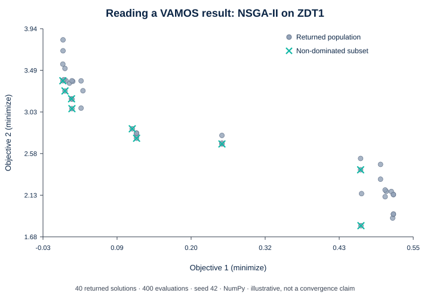

  

    
VAMOS · Scientific Python

    <h1>Multi-objective optimizationbuilt for reproducible studies.</h1>
    
Compare algorithms, solve your own problems, and preserve the evidence behind every run.

    

      <a class="vamos-button vamos-button--primary" href="guide/getting-started/">Get started</a>
      <a class="vamos-button vamos-button--secondary" href="reference/api_reference/">API reference</a>
    

    

      $<code>python -m pip install "vamos-optimization==1.0.1"</code>
    

  

  

  

    

    <pre><code>from vamos import optimize

result = optimize(
    "zdt1",
    algorithm="nsgaii",
    pop_size=40,
    max_evaluations=400,
    engine="numpy",
    seed=42,
)

front = result.front()</code></pre>
    
40 solutions · 2 objectives

  

  <figure class="vamos-hero__result">
    
    <figcaption>Real output from the code shown: 400 evaluations, seed 42. A first run, not a convergence benchmark. <a href="guide/understanding-results/">Read and reproduce this result →</a></figcaption>
  </figure>
  

  <a class="vamos-journey" href="guide/zero_to_hero/">
    01
    <h2>Try VAMOS</h2>
    
Run a built-in problem and inspect its trade-offs.

    Quickstart →
  </a>
  <a class="vamos-journey" href="guide/custom-problem/">
    02
    <h2>Solve my problem</h2>
    
Define your decisions, objectives, bounds, and constraints.

    Custom problems →
  </a>
  <a class="vamos-journey" href="guide/studies/">
    03
    <h2>Run a reproducible study</h2>
    
Plan a study, check its budget, and trace every result.

    Reproducible studies →
  </a>

**Prefer runnable source?** [Run the three executable journeys](examples.md#three-executable-journeys).

## From a first run to a scientific study

VAMOS 1.0 distinguishes stable optimization, run-artifact, and single-owner study surfaces from experimental features such as Studio, provider integrations, and tuning. Check [Stability and versioning](project/stability-and-versioning.md) before depending on an API as a 1.x compatibility commitment.

  
<strong>Algorithms</strong>NSGA-II/III, MOEA/D, SMS-EMOA, SPEA2, IBEA, SMPSO, AGE-MOEA, RVEA.

  
<strong>Encodings</strong>Real, integer, binary, permutation, and mixed decision variables where supported.

  
<strong>Backends</strong>NumPy reference execution with optional Numba kernel and MooCore indicator acceleration.

  
<strong>Research tooling</strong>Studies, benchmarking, tuning, result inspection, verification, replay, and analysis.

For precise signatures and configuration contracts, use the [API reference](reference/api_reference.md), [algorithm reference](reference/algorithms.md), and [problem reference](reference/problems.md).

## Project and citation

Citation metadata is maintained in [`CITATION.cff`](https://github.com/vamos-optimization/VAMOS/blob/main/CITATION.cff). Security policy and supported reporting channels are maintained in [`SECURITY.md`](https://github.com/vamos-optimization/VAMOS/blob/main/SECURITY.md). See [Known limitations](project/known-limitations.md), the [roadmap](roadmap.md), and [repository governance](project/repository-governance.md) for project-level information.
